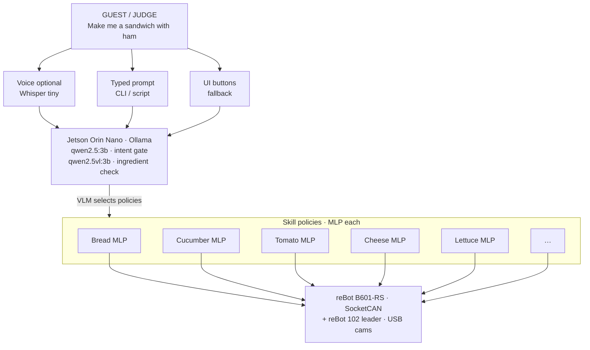

<div align="center">

# 🥪 ORDER UP
### Voice-Conditioned Sandwich Assembly on a reBot Arm

**Revolute Hackathon 2026** · FabLab Kendall · Cambridge, MA  
*Physical AI · Cooking with robot arms · Seeed reBot B601-RS + Jetson Orin Nano*

[](https://revolutehack.com/)
[](https://www.seeedstudio.com/)
[](https://www.seeedstudio.com/)
[](https://github.com/huggingface/lerobot)
[](./LICENSE)

<br/>

**Say the order. See the station. Serve the sandwich.**

*A judge walks up, speaks a sandwich order, and a 6‑DOF arm executes recorded kitchen skills on a fixed deli station — with on-device language + vision, and a teleop fallback so the deli never goes down.*

<br/>

[Quick Start](#-quick-start) ·
[Architecture](#-system-architecture) ·
[Demo Gallery](#-demo-gallery--video) ·
[Judging Map](#-how-we-map-to-judging-criteria) ·
[Reproduce](#-reproduce-the-demo)

</div>

---

## 🎬 Demo Gallery / Video

> **Drop final clips in [`video/`](./video/).**  
> GitHub will render MP4s inline once files land. Until then, placeholders mark the collage.

<table>
  <tr>
    <td width="50%" align="center" valign="top">
      <h3>01 · One-minute showcase</h3>
      <p><em>Voice → intent → sandwich → “Order up!”</em></p>
      <!-- After upload: <video src="./video/01-one-minute-showcase.mp4" controls width="100%"></video> -->
      <a href="./video/">
        
      </a>
      <p><code>video/01-one-minute-showcase.mp4</code></p>
    </td>
    <td width="50%" align="center" valign="top">
      <h3>02 · Live order (science fair)</h3>
      <p><em>Judge places a custom order at the table</em></p>
      <a href="./video/">
        
      </a>
      <p><code>video/02-live-order.mp4</code></p>
    </td>
  </tr>
  <tr>
    <td width="50%" align="center" valign="top">
      <h3>03 · Teleop → trajectory capture</h3>
      <p><em>Leader arm demos that become skills</em></p>
      <a href="./video/">
        
      </a>
      <p><code>video/03-teleop-capture.mp4</code></p>
    </td>
    <td width="50%" align="center" valign="top">
      <h3>04 · Vision ingredient gate</h3>
      <p><em>Qwen2.5-VL checks labeled mise en place</em></p>
      <a href="./video/">
        
      </a>
      <p><code>video/04-vision-ingredient-gate.mp4</code></p>
    </td>
  </tr>
  <tr>
    <td colspan="2" align="center" valign="top">
      <h3>05 · Failure recovery (teleop handoff)</h3>
      <p><em>Graceful degradation is a feature — not an apology</em></p>
      <a href="./video/">
        
      </a>
      <p><code>video/05-fallback-teleop.mp4</code></p>
    </td>
  </tr>
</table>

<details>
<summary><b>How to publish videos into this gallery</b></summary>

1. Export short MP4s (H.264, ≤ ~50–80 MB each for comfortable GitHub browsing; larger files → Git LFS or external link).
2. Place them in [`video/`](./video/) using the filenames above (or update this README).
3. Uncomment the `<video src="...">` tags (or keep clickable placeholders).
4. Prefer **one hero 60s clip** for Devpost/Hackster + this gallery.

</details>

---

## 🧠 What we built

**Order Up** is a **deli station**, not a free-form chef.

| Layer | Behavior |
|-------|----------|
| **Language** | Local **Ollama** (`qwen2.5:3b`) on Jetson decides if the utterance means *make a sandwich* (paraphrase-tolerant) |
| **Vision** | **Qwen2.5-VL 3B** photographs the station and checks **text-labeled** ingredients (precision > guessy recognition) |
| **Motion** | Per-ingredient **MLP policies** (bread, cucumber, tomato, cheese, …) selected by the VLM and run on the **reBot B601-RS** follower |
| **Voice (optional front door)** | Local **Whisper** STT ([`voice_agent/`](./voice_agent/)) → text → Ollama — no cloud Whisper bill |
| **Safety net** | Leader-arm teleop + kill switches so the live demo still *serves* if a model flakes |

### Why this design wins weekends

- **Narrow & repeatable** — fixed bins, fixed plate, open-face assembly  
- **On-device Physical AI** — language + vision + control on Jetson, not a laptop theater  
- **Product-shaped** — a guest can order; the system confirms and executes  
- **Honest robotics** — we document motor limits, CAN quirks, VRAM tricks, and false-positive vision fixes in [`commands.txt`](./commands.txt)

---

## 🏗️ System architecture

Policies are small **MLPs** (one skill each), trained to overfit a single teleop demo. The on-device VLM checks which labeled ingredients are on the station, then selects and sequences the matching policy blocks.



### Hardware (event kit)

| Qty | Device | Role |
|----:|--------|------|
| 1 | **Seeed reBot Arm B601-RS** | Follower / worker (6‑DOF + gripper) |
| 1 | **reBot Arm 102 leader** | Teleoperation & trajectory capture |
| 1 | **reComputer Jetson Orin Nano** | Edge LLM/VLM + control host |
| 2 | **USB cameras** | Station view / ingredient check |

### Software pillars

| Pillar | Implementation |
|--------|----------------|
| Control & data | [LeRobot](https://github.com/huggingface/lerobot) + Seeed reBot plugins (`seeed_b601_rs_follower`, `rebot_arm_102_leader`) |
| Skills | MLP policies per ingredient · train from teleop demos · [`lerobot-train-bread-mlp`](./commands.txt) · [`lerobot-play-by-prompt`](./commands.txt) |
| Intent | Ollama · `lerobot-play-by-prompt` · paraphrase match for sandwich intent |
| Vision gate | Camera frame → Qwen2.5-VL · **text labels required** for precision |
| Voice agent | [`voice_agent/`](./voice_agent/) · free local Whisper · HTTP to Ollama |

---

## ✨ Highlights that show technical depth

<details open>
<summary><b>Edge LLM + VLM under real memory pressure</b></summary>

- Dual 3B models on Jetson **cannot** both stay warm — we hit `cudaMalloc failed` with default `keep_alive`.
- Fix: **unload text model** (`keep_alive=0`) before vision; shrink context windows (1024/2048).
- Vision latency: merge description + ingredient check into **one** Ollama call (~11 s warm vs ~27 s for two).

</details>

<details>
<summary><b>Vision that prefers labels over vibes</b></summary>

A 3B VLM guessing “ham” next to a cheese bag is a demo killer.  
Our prompt requires the model to **read the ingredient name as text** on packaging/cards — trading recall for **precision** so the gate doesn’t green-light missing food.

</details>

<details>
<summary><b>Hardware-honest control notes</b></summary>

Documented and versioned in-repo:

- `max_relative_target` speed caps for safer teleop  
- wrist_roll **mechanical stop** (don’t widen past hardware)  
- `leader_unwrap.patch` for wraparound jumps past ±180°  
- gripper scale vs clamp (mapping travel without lying about torque control)  
- CAN connect retries after teleop handoff  

See [`commands.txt`](./commands.txt) and [`leader_unwrap.patch`](./leader_unwrap.patch).

</details>

<details>
<summary><b>Graceful product failure modes</b></summary>

| Priority | Mode |
|:--------:|------|
| 1 | Full auto: prompt + vision + trajectory sequence |
| 2 | Prompt + trajectories (vision report-only) |
| 3 | Trajectory playback only |
| 4 | Live teleop assembly with the leader arm |

**#4 still makes a sandwich in front of judges.**

</details>

---

## 🚀 Quick start

### 0. Repo map (what judges should open)

```text
.
├── README.md                 ← you are here
├── video/                    ← demo collage (upload MP4s here)
├── voice_agent/              ← STT → Ollama client (Mac/Linux)
├── trajectories/             ← recorded sandwich skills (JSON @ 60 Hz)
│     rscheese / rscucumber / srstomato / first_bread / …
├── commands.txt              ← day-of runbook (calibrate · teleop · prompt)
├── leader_unwrap.patch       ← leader wrist wrap fix
└── src/lerobot/              ← LeRobot core (upstream + team integrations)
```

### 1. Robot bring-up (Jetson)

```bash
# CAN interface (name may be can0 / can2 on your kit)
export PCAN_IF=can0
sudo ip link set $PCAN_IF down 2>/dev/null || true
sudo ip link set $PCAN_IF type can bitrate 1000000 restart-ms 100
sudo ip link set $PCAN_IF up
sudo chmod 666 /dev/ttyUSB0   # leader UART — adjust path

# Calibrate once per machine
lerobot-calibrate \
  --robot.type=seeed_b601_rs_follower \
  --robot.port="$PCAN_IF" \
  --robot.id=follower1 \
  --robot.can_adapter=socketcan
```

Full day-of recipes: **[`commands.txt`](./commands.txt)**.

### 2. Capture a skill

```bash
lerobot-teleop-record \
  --robot.type=seeed_b601_rs_follower \
  --robot.port="$PCAN_IF" \
  --robot.id=follower1 \
  --robot.can_adapter=socketcan \
  --teleop.type=rebot_arm_102_leader \
  --teleop.port=/dev/ttyUSB0 \
  --teleop.id=rebot_arm_102_leader
# r = record · s = save · q = quit  → trajectories/<name>.json
```

### 3. Language → motion

```bash
# Ensure Ollama is up (auto-started by the tool if configured)
~/.local/bin/ollama serve &

lerobot-play-by-prompt \
  --robot.type=seeed_b601_rs_follower \
  --robot.port="$PCAN_IF" \
  --robot.id=follower1 \
  --robot.can_adapter=socketcan \
  --prompt="make a sandwich" \
  --camera=/dev/video2 \
  --ingredients="[bread, cheese, ham]"
```

### 4. Voice front door (laptop or Jetson)

```bash
cd voice_agent
./install_whisper.sh              # free local tiny.en — no API key
python voice_to_ollama.py \
  --host JETSON_IP:11434 \
  --ollama-model qwen2.5:3b \
  --duration 5
```

---

## 🧪 Demo script (science-fair table)

1. **Station ready** — taped bins, labeled cards, plate, E-stop known  
2. **Cold open** — “We’re Order Up: speak a sandwich order.”  
3. **Live order** — judge speaks or types a sandwich phrase  
4. **Vision beat** — show console: present / missing ingredients  
5. **Motion beat** — trajectories execute; open-face stack appears  
6. **Close** — “Order up!” + pointer to this README + 1‑min video  
7. **If anything fails** — seamless teleop finish (we practice the handoff)

**Success metric:** base bread + ≥1 topping, three clean runs, no unplanned arm motion.

---

## 📊 How we map to judging criteria

Official Revolute scoring (100 pts):

| Category | Pts | How this repo + demo address it |
|----------|----:|----------------------------------|
| **Documentation completeness** | **40** | |
| · Presentation deck | 5 | Organizer/team deck assets in repo (`Revolute Hackathon.pdf`) + external drive/PPT link in submission |
| · **GitHub + versioned code + README** | **10** | This document · [`commands.txt`](./commands.txt) · [`voice_agent/`](./voice_agent/) · trajectory artifacts · patches · commit history |
| · Live demo | 15 | Table script above · kill-switch ladder · fixed station |
| · Demo video + project intro | 10 | [`video/`](./video/) collage + Devpost/Hackster upload |
| **Technical difficulty** | **30** | |
| · Ambition | 10 | On-device LLM + VLM + multi-trajectory skills + optional STT |
| · Accuracy | 10 | Label-based vision gate · intent match · calibrated teleop paths |
| · Consistency | 10 | Fixed layouts · speed caps · connect retries · report-only → enforce flags |
| **Product / Taste** | **30** | |
| · Creativity | 10 | Voice-conditioned deli product, not a random pick-and-place |
| · Taste / Edibility | 10 | Real ingredients / food-safe station (H‑Mart gift cards welcome 😉) |
| · Chef’s opinion | 10 | Clean mise en place · open-face plating · “somewhat edible” bar cleared |

---

## 📁 Repository guide

| Path | Purpose |
|------|---------|
| [`voice_agent/`](./voice_agent/) | Cross-platform mic → local Whisper → Ollama client |
| [`trajectories/`](./trajectories/) | Skill library JSON (cheese, cucumber, tomato, bread, …) |
| [`commands.txt`](./commands.txt) | Operator runbook (the real “how we run it”) |
| [`leader_unwrap.patch`](./leader_unwrap.patch) | Leader wrist wrap fix |
| [`video/`](./video/) | **Demo collage** (upload finals here) |
| [`src/lerobot/`](./src/lerobot/) | LeRobot foundation (Apache-2.0) |
| [`tests/`](./tests/) | Upstream + integration test suite |

---

## 🛡️ Safety

- Keep **E-stop / power** within reach; never reach into bins during policy/playback.  
- After power or signal glitches: **stop code → home → reconnect** (Seeed guidance).  
- `max_relative_target` limits per-cycle jumps during teleop.  
- Vision/language never move the arm unless intent gate passes (non-sandwich prompts do nothing).

---

## 👥 Team & event

| | |
|--|--|
| **Event** | [Revolute 2026](https://revolutehack.com/) — Boston’s Physical AI / robotics hackathon |
| **Venue** | FabLab Kendall · 325 Main St, Cambridge |
| **Theme** | Cooking with robot arms |
| **Hardware partners** | Seeed Studio reBot + reComputer Jetson |
| **Framework** | Hugging Face LeRobot (this tree is a working hackathon fork with team extensions) |

> Built in ~48 hours. Optimized for a **reliable live demo**, not a paper.

---

## 🗺️ Roadmap (post-demo stretch)

- [ ] Per-ingredient ACT policies trained from teleop datasets  
- [ ] Closed-face top-bread skill  
- [ ] Streaming STT with barge-in cancel  
- [ ] Multi-order queue / “hold the tomato” composition  
- [ ] Publish 1‑min hero video to Devpost/Hackster  

---

## 📜 License & attribution

- Project code & docs in this fork: see [`LICENSE`](./LICENSE) (Apache-2.0 via LeRobot lineage).  
- LeRobot © Hugging Face contributors.  
- Hardware designs & SDKs © Seeed Studio / respective vendors.  
- Models via Ollama model library (Qwen family) under their upstream licenses.

---

<div align="center">

### *Order up.*

**Documentation is part of the product.**  
If you’re a judge: thank you — open [`video/`](./video/), skim [`commands.txt`](./commands.txt), and ask us for a live sandwich.

<br/>

<sub>Revolute Hackathon 2026 · Cambridge, MA · Physical AI should be delicious.</sub>

</div>
